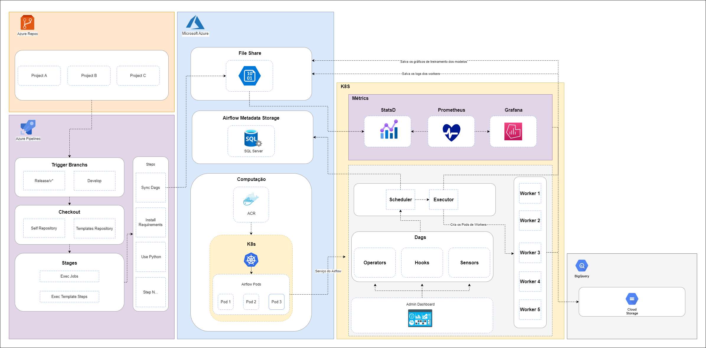

# Template de DAG para  

- [Introdução](#introdução)
- [Tecnologias utilizadas](#tecnologias-utilizadas)
- [Estrutura do projeto](#estrutura-do-projeto)
- [Primeiros passos](#primeiros-passos)
- [Explicação dos módulos](#explicação-dos-módulos)
- [Passos importantes](#passos-importantes)
- [Arquitetura](#arquitetura)

## Introdução
O projeto em questão, foi desenvolvido utilizando as ferramentas que o time já tem experiência com a principal finalidade de economizar tempo
para iniciar o desenvolvimento de novas DAGs para disparar o treinamento de modelos atrtavés do Airflow.

## Tecnologias utilizadas
* Mlflow
* Python 3.8
* Conda
* Apache Airflow 2.2.4

## Estrutura do projeto
```bash
├── docs
│   ├── airflow-v2.drawio
│   ├── airflow.png
│   └── architecture.png
├── pipelines
│   └── azure-pipelines.yaml
├── src
│   └── dags
│       ├── dags_autoload
│       │   └── autoload.py
│       ├── decoratos
│       │   └── azureml_connect_decorator.py
│       ├── hooks
│       │   └── .gitkeep
│       ├── operatos
│       │   └── .gitkeep
│       ├── utils
│       │   ├── .gitkeep
│       │   ├── azureml_connect_utils.py
│       │   └── dag_utils.py
│       └── test_template_dag.py
├── temp
│   └── .gitkeep
├── .gitignore
└── README.md
```

## Primeiros passos
O template atual contém um padrão de hierarquia de módulos já utilizadas em outras DAGs no time. 

### Explicação dos módulos
* **_`pipelines`_**
    1. O arquivo _`yaml`_ da pipeline do _`Azure DevOps`_ com as etapas que são costumeiras nas _`pipelines`_ de **CI** dos projetos das DAGs que disparam treinamentos de modelos.

* **_`src/dags/dags_autoload`_**
    1. É o diretório que contém o módulo _`autoload.py`_, ele contém duas funções que são utilizadas para a sua DAG conseguir importar os seus módulos _`custom`_ que desenvolveu. Exemplo: módulos de utils que você criou.

* **_`src/dags/decorators`_**
    1. É o diretório que contém o módulo _`azureml_connect_decorator.py`_ que é utilizado para abrir um contexto com conexão com o _`Azure ML`_.

* **_`src/dags/hooks`_**
    1. Diretório para alocar _`hooks`_ customizados caso precise criar um.

* **_`src/dags/operators`_**
    1. Diretório para alocar _`operators`_ customizados caso precise criar um.

* **_`src/dags/utils`_**
    1. Diretório para alocar módulos customizados caso precise. Exemplo: módulo de conexão com _`Azure ML`_.

* **_`src/dags/test_template_dag.py`_**
    1. Módulo com uma estrutura padrão de DAG que utiliza o _`decorator`_ de conexão com o _`Azure ML`_.
### Passos importantes
Dentro do módulo _`src/dags/test_template_dag.py`_ existem alguns pontos que devem ser alterados conforme a finalidade da sua DAG.

Siga os passos abaixo:

* Na linha **`21`**, onde está o template **`<NOME-DO-REPOSITORIO>`**, você deve trocá-lo pelo nome do repositório de _`Pipeline de treinamento de modelo`_ que está dentro do _`Azure DevOps`_ e que você queira executar;
*  Na linha **`22`**, onde está o template **`<NOME-DO-EXPERIMENTO-NA-AZURE-ML>`**, você deve trocá-lo pelo nome do experimento e modelo que você deseja executar dentro do _`Azure ML`_;
* Na linha **`48`**, onde está escrito **`nome_da_sua_dag`**, você deve trocar pelo nome que você queira que seja mostrado dentro do _`Airflow`_;
* Na linha **`65`**, onde está escrito **`seu_task_id`**, você deve trocar para um _**`ID`**_ que você queira que seja fácil de rastrear dentro da interface do _`Airflow`_;
* No módulo _`src/dags/decorators/azureml_connect_decorator.py`_, na linha **`8`**, onde está escrito **`<NOME-DO-SEU-REPOSITORIO>`**, você deve trocá-lo pelo nome do repositório de DAG que você está trabalhando. 
## Arquitetura


